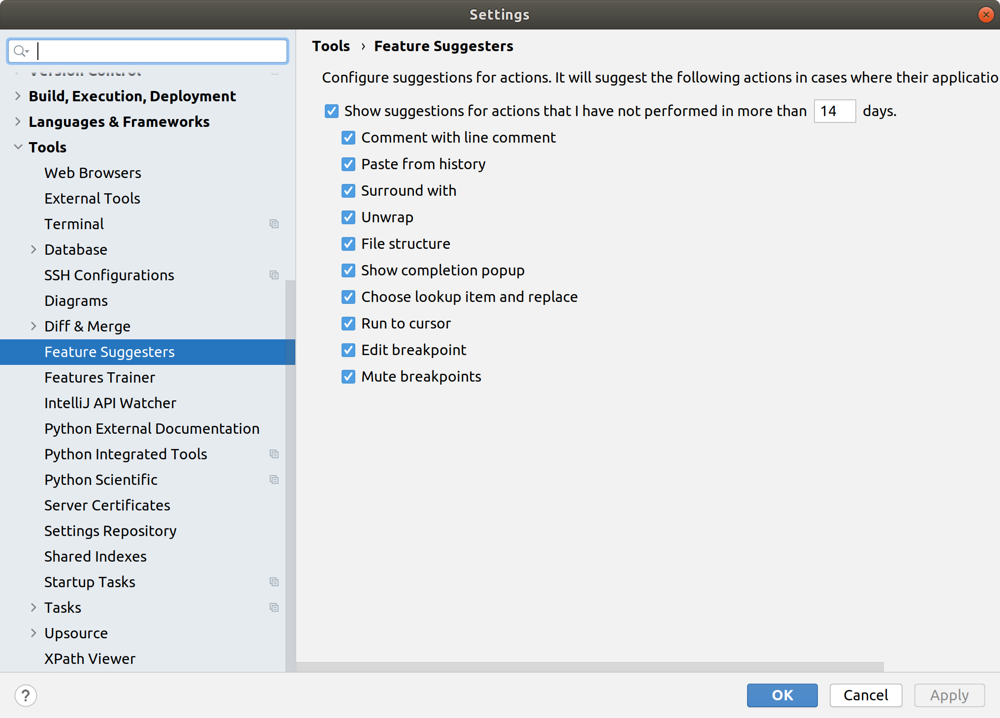

# IDEA Feature Suggester 

<!-- Plugin description -->
**IDEA Feature Suggester** is an IntelliJ Platform plugin that analyzes your actions while coding and suggests IDE actions to make you work more efficiently.

Have you ever struggled to find an action in IntelliJ IDEA?
Sometimes, for an inexperienced user, it may be challenging to perform some simple tasks.
IDE is overloaded with tons of useful functionality, but it may be unclear what exactly you need at the moment.
**IDEA Feature Suggester** can help you to find the necessary actions only when you really need them.
It won't continuously spam you with tips.
With this plugin, you can learn new and rediscover old IDE actions.

Currently, it can suggest features related to working with a clipboard, comments, file structure, completion, refactoring, and debugging in Java, Kotlin, Python, and JavaScript.
<!-- Plugin description end -->

## Supported IDEs and Languages

**IDEA Feature Suggester** can be installed in any IntelliJ Platform-based IDE.
Currently, the plugin fully supports Java and Kotlin, partially supports Python and JavaScript.

## Installation

* In the IDE plugin settings:
    * <kbd>Settings</kbd> > <kbd>Plugins</kbd> > <kbd>Marketplace</kbd> > <kbd>Search for "IDEA Feature Suggester"</kbd> > <kbd>Install Plugin</kbd>
* Manually from disk:
    * Download the [needed version](https://plugins.jetbrains.com/plugin/7242-idea-feature-suggester/versions) and install it using <kbd>Settings</kbd> > <kbd>Plugins</kbd> > <kbd>Install Plugin from Disk…</kbd>

## Usage Instructions

No exact instructions are intended at the moment.
The plugin will notify you when some actions can be performed more efficiently.
If you don't want to see some of the suggestions, you can configure the plugin settings:

Here are several examples of the suggestions you can get from the plugin:

### Conditional breakpoint

### File structure

### Surround with

### Unwrap

***

**IDEA Feature Suggester** has been created as a concept during one of the internal JetBrains Hackathons in 2013.
Recently, the codebase has been rewritten entirely from Scala to Kotlin language, and since then, it’s again actively maintained.
